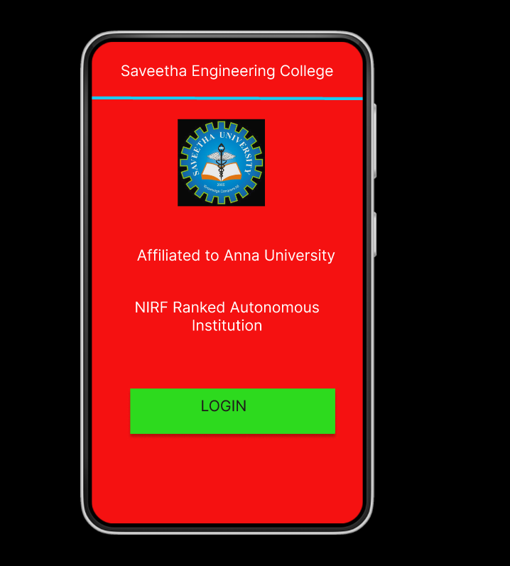
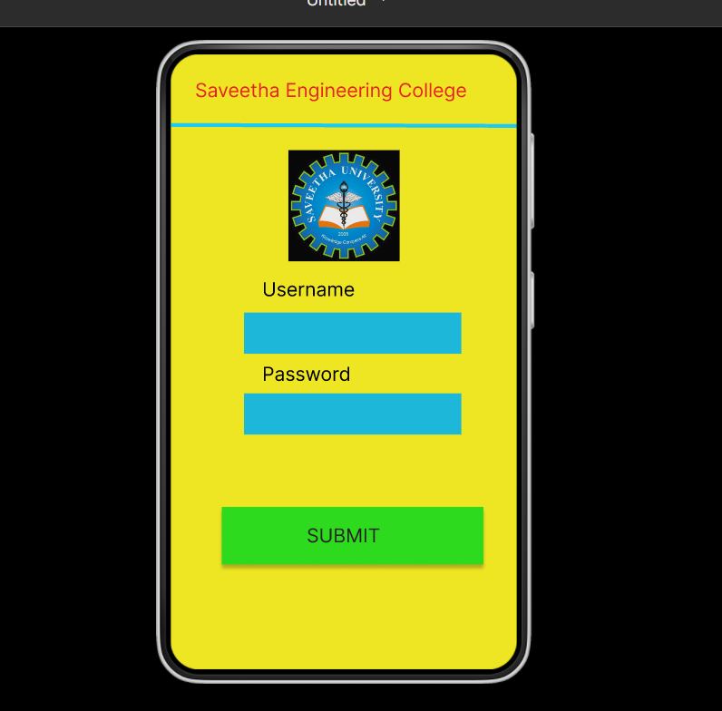
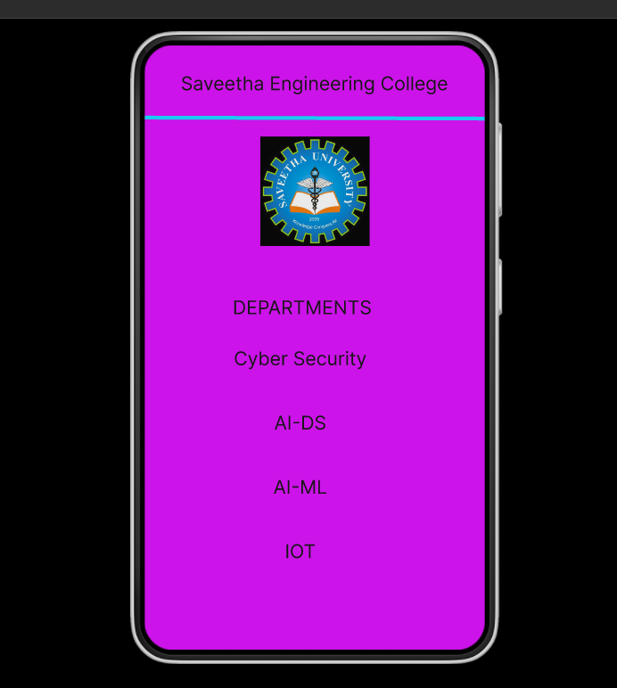

# Event Registration Web Application

## AIM:
To design, develop and deploy a web application for event registration.

## DESIGN STEPS:

### Step 1:
Go to the figma.com website.

### Step 2:
login and create a team project.

### Step 3:

Each team members can take part in designing the pages.
### Step 4:
Create login page, home page, report page, registration page and thank you page.

### Step 5:
Prototype the pages.

### Step 6:

Validate the HTML and CSS code.

### Step 6:

Publish the website in the given URL.

## DESIGN:
Figma
## PROGRAM :
```
/* HOME PAGE */


position: relative;
width: 360px;
height: 640px;
background: #F51111;


/* LOGIN PAGE */


position: relative;
width: 360px;
height: 640px;
background: #EEE623;


/* SEC page */


position: relative;
width: 360px;
height: 640px;
background: #CC13EA;

```


## OUTPUT:




## Result:
Thus, A Web application for event registration is designed and displayed.
